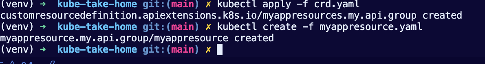
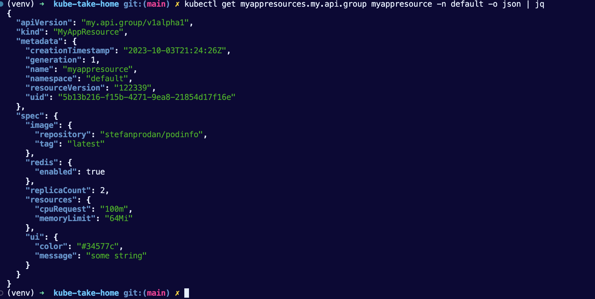

# how to instructions


### pre-reqs

### Install the virtualenv package (if using python3)
pip3 install virtualenv

### Navigate to your project directory
cd /path/to/your/project

### Create a new virtual environment
virtualenv venv

### Activate the virtual environment
source venv/bin/activate

## install required packages

pip3 install kubernetes <p>
pip3 install yaml <p>


## install or start minikube (assuming you have brew installed)

brew install minikube

minikube start

## setting up application

Before you can create a Custom Resource, you must first create a Custom Resource Definition (CRD) that defines the new resource type. The CRD defines the resource kind (in this case, `MyAppResource`), and the properties of the resource.

## deploy crd first

```kubectl apply -f crd.yaml```

## create resources from crd and yaml file

```kubectl create -f myappresource.yaml```


## verify its deployed

```kubectl get crd```




## verify service is running

```kubectl get crd myappresources.my.api.group -o jsonpath='{.status.conditions[?(@.type == "Established")].status}'```

## verify app is up

```kubectl get pods```

```kubectl describe pod whatever```

## if app is running now check in localhost

```localhost:8080```

### troubleshoot if pod is not started

```

kubectl get myappresources.my.api.group myappresource -n default -o json | jq

```


TRUE - is the response to know its installed and you have e everything setup.


---





# deploy to cluster with python script

### Activate the virtual environment
source venv/bin/activate

### install required packages

pip3 install kubernetes <p>
pip3 install yaml <p>

```python3 controller3.py```

Script will stay running and update any reconciled differences it needs ot make with a patch to the API

after done remove resources

```kubectl delete myappresources myappresource```